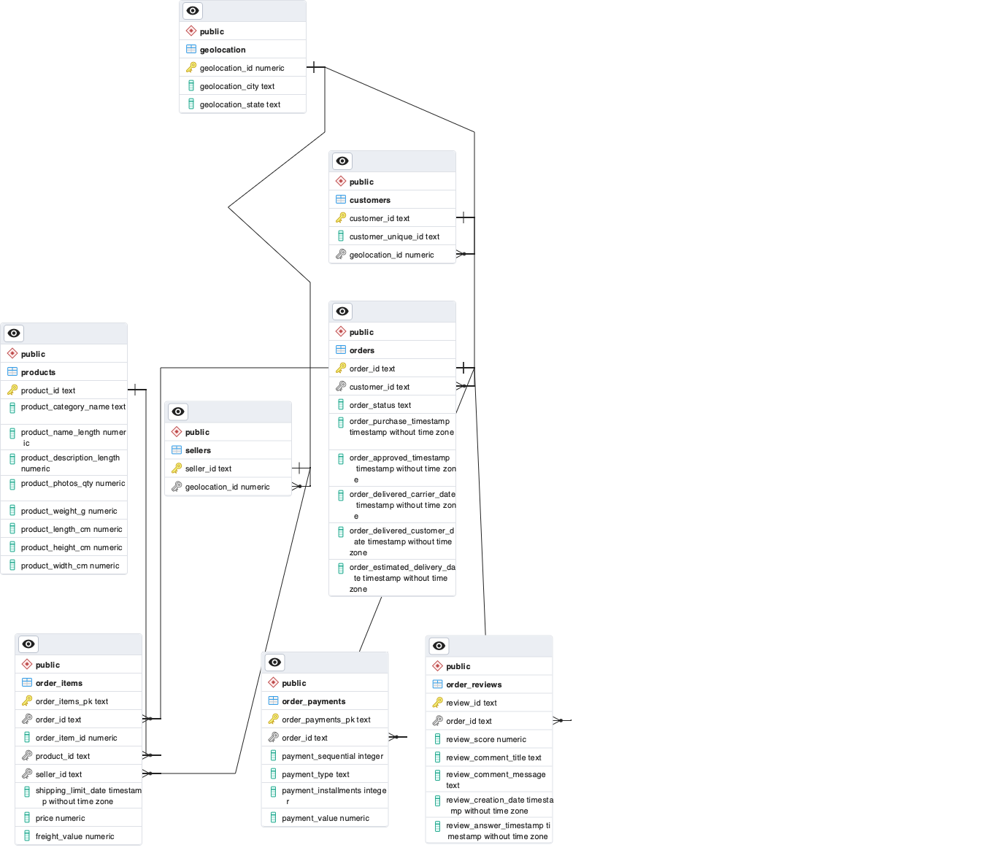

# Brazilian E-Commerce

This project's objective is to provide a POSTGRESQL database with a set of tables that can be used to analyze the brazilian e-commerce market. 

Data source is obtained from [Kaggle](https://www.kaggle.com/olistbr/brazilian-ecommerce).

## Data Model

This is the ERD diagram of the POSTGRESQL database that was created after preprocessing the data.

